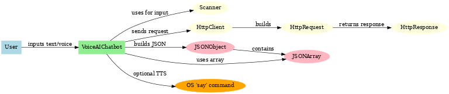
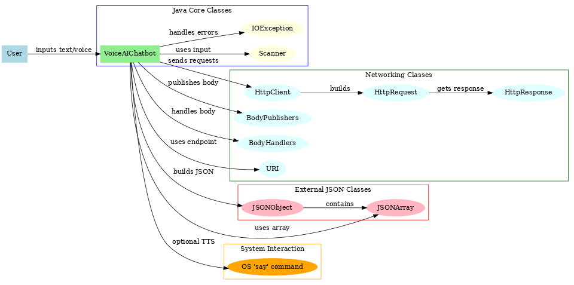

🎤 VoiceAIChatbot: Where AI Meets Your Voice
📸 Screenshots:

### System ERD
This diagram shows the Entity-Relationship model for the VoiceAIChatbot, illustrating the main components and data flow.



### Presentation ERD

A more detailed diagram used in presentations to explain the chatbot architecture, interactions, and AI integration.




Project Title and Description:
# VoiceAIChatbot
🎤 A voice-enabled AI chatbot in Java using Groq API. Currently supports **text input** and **text-to-speech responses**.


Features Section:
## Features
- Text input chatbot  
- Optional speech responses  
- Environment-variable safe API key usage  
- Clean project structure with compiled code and dependencies separated  


Project Structure Section:
## Project Structure

VoiceAIChatbot/
│── src/
│   └── VoiceAIChatbot.java
│── JarFiles/
│   └── json-20240303.jar
│── bin/
│   └── VoiceAIChatbot.class
│── docs/
│   ├── VoiceAIChatbot_ERD.png
│   └── VoiceAIChatbot_Presentation_ERD.png
│── extras/
│   └── voice_recognition.py
│── .gitignore
│── README.md


Setup Instructions Section:
## Setup Instructions

1. **Clone the repository:**
```bash
git clone https://github.com/RanjitShahKanu024/VoiceAIChatbot.git
cd VoiceAIChatbot


Set your Groq API key (environment variable):
export GROQ_API_KEY="your_api_key_here"


Compile the Java code:
javac -cp "JarFiles/*" -d bin src/VoiceAIChatbot.java


Run the chatbot:
java -cp "JarFiles/*:bin" VoiceAIChatbot


